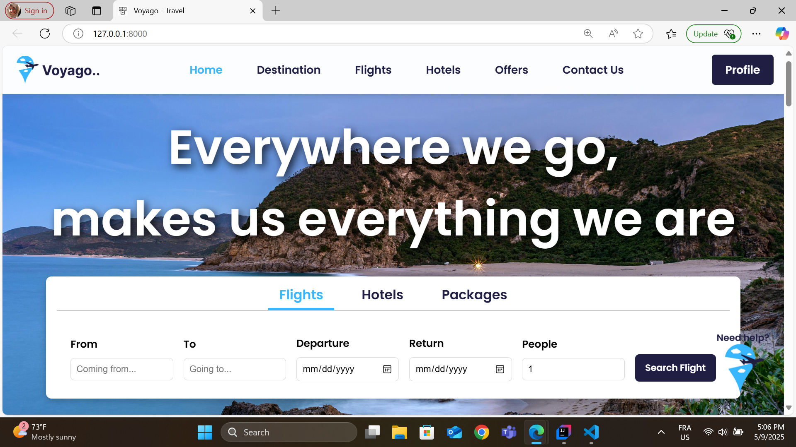
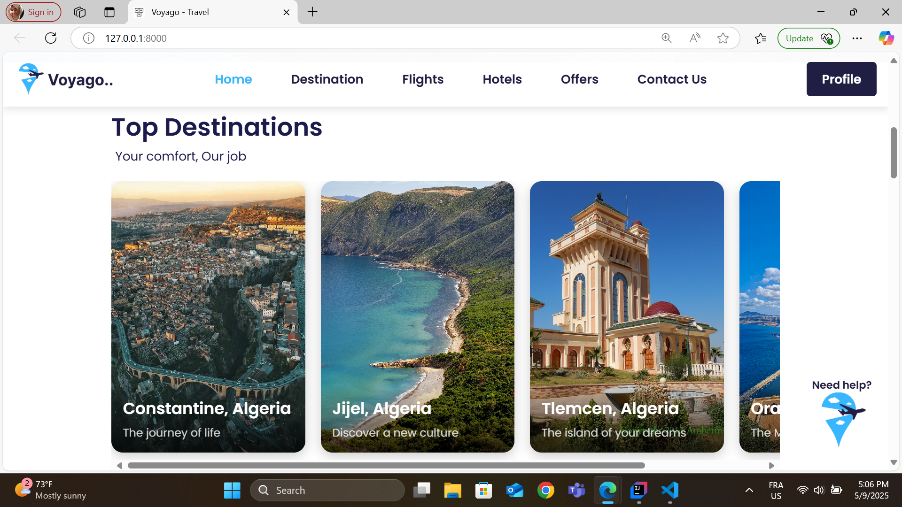
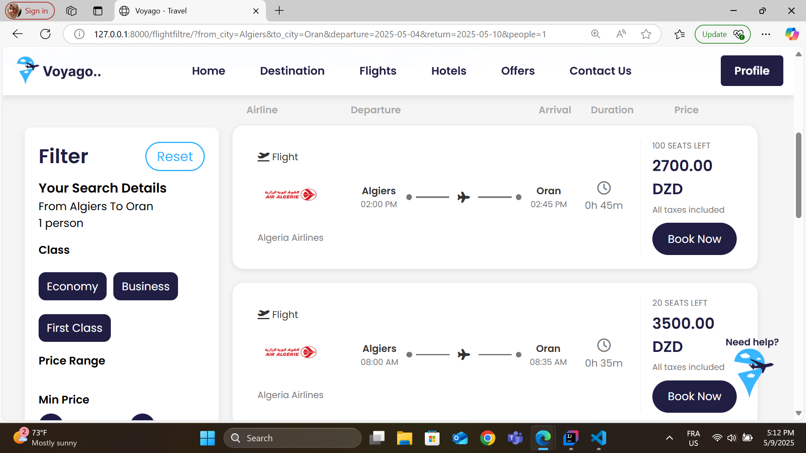
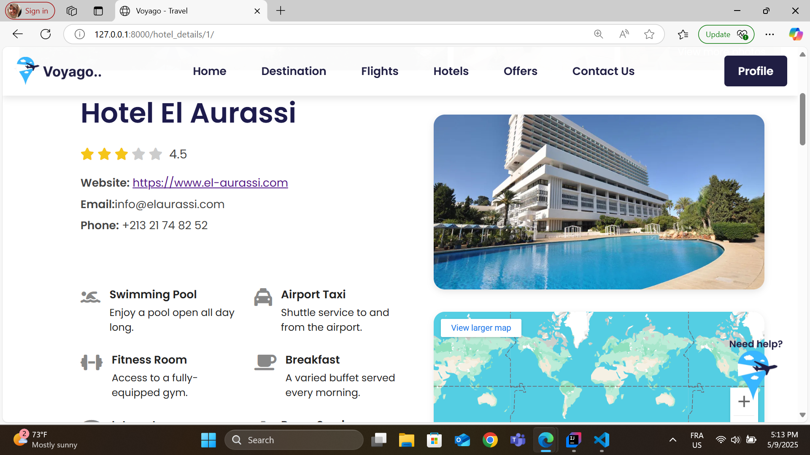
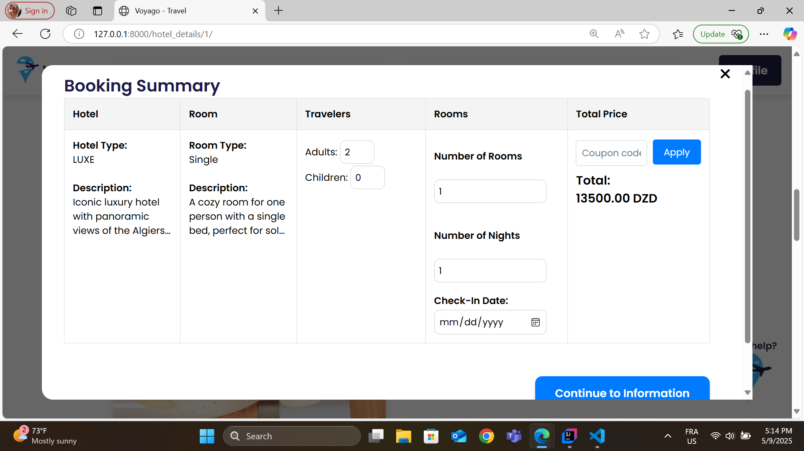
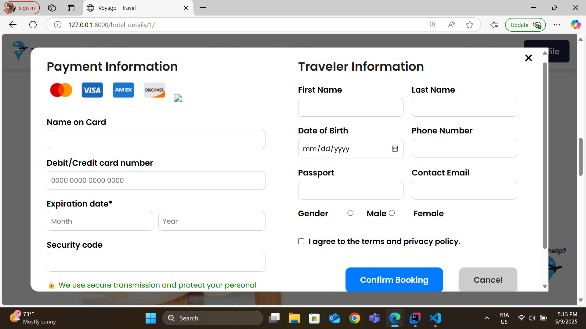
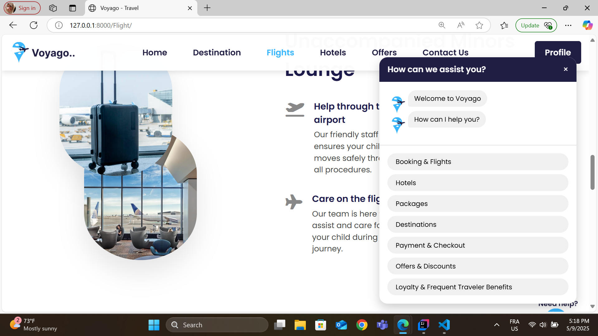

# 🌍 Travel Agency Website

A full-stack **Django web application** for a travel agency.  
The platform allows users to explore destinations, view travel packages, and make bookings online, while admins can manage trips, pricing, and availability.

## 🚀 Tech Stack
- **Backend:** Django, Python, PostgreSQL
- **Frontend:** HTML, CSS
- **Database:** PostgreSQL
- **Other:** Django Admin

## ✨ Features
- Browse destinations , Flights, Hotels and travel packages.
- Filter/search trips by category, price, or availability.
- Booking with a simple reservation form.
- User authentication (sign up, login, logout).
- Admin panel to manage destinations, packages, and bookings with dashboard also.
- Responsive UI for desktop and mobile.
- chat-box assistant.

## 📸 Screenshots
Homepage:  


Destinations list:  


Flights list:  


Hotel page:  


Booking form:  



chat-box assistant:



## 🎥 Demo Video
▶️ [Watch the demo](https://youtu.be/74uRG777OEM)

## ⚙️ Installation & Setup
1. Clone the repository:
   ```bash
   git clone https://github.com/yourusername/travel-agency-django.git
   cd travel-agency-django
